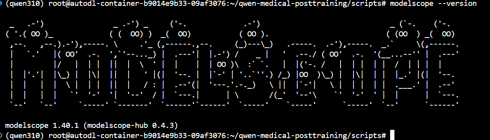

# Day 03 - Qwen 大模型推理与 Tokenizer

## 今日目标

理解：

- LLM
- Token
- Tokenizer
- input_ids
- Chat Template
- Inference
- Generation
- max_new_tokens
- GPU / CUDA
- Causal Language Model

## 一、大模型推理流程

用户输入文本
↓
Tokenizer
↓
Token
↓
input_ids
↓
Qwen Transformer
↓
预测下一个 token
↓
把新 token 接回输入
↓
继续预测
↓
Tokenizer 解码
↓
最终文字答案

## 二、今天使用的模型

Model:

参数量:

输入问题:

input_ids shape:

GPU:
最开始的时候配置显示：
 0  NVIDIA GeForce RTX 4090 D      On  |   00000000:B1:00.0 Off |                  Off |
| 30%   30C    P8             19W /  425W |       1MiB /  24564MiB |      0%      Default |
|                                         |                        |                  N/A |
+-----------------------------------------+------------------------+----------------------

显存:

生成耗时:

模型输出:

## 三、今天学到的核心概念

### Token

### Tokenizer

### input_ids

### Inference

### Chat Template

### max_new_tokens

## 四、实验

### Prompt 1
（1）实验：直接运行qwen模型回答：请用简单的语言解释EEG中的Alpha波是什么？
（2）第一次运行结果：报错
Traceback (most recent call last):
  File "/root/qwen-medical-posttraining/scripts/./qwen_inference.py", line 46, in <module>
    tokenizer = AutoTokenizer.from_pretrained(model_name)
  File "/root/miniconda3/envs/qwen310/lib/python3.10/site-packages/transformers/models/auto/tokenization_auto.py", line 966, in from_pretrained
    config = AutoConfig.from_pretrained(
  File "/root/miniconda3/envs/qwen310/lib/python3.10/site-packages/transformers/models/auto/configuration_auto.py", line 1114, in from_pretrained
    config_dict, unused_kwargs = PretrainedConfig.get_config_dict(pretrained_model_name_or_path, **kwargs)
  File "/root/miniconda3/envs/qwen310/lib/python3.10/site-packages/transformers/configuration_utils.py", line 590, in get_config_dict
    config_dict, kwargs = cls._get_config_dict(pretrained_model_name_or_path, **kwargs)
  File "/root/miniconda3/envs/qwen310/lib/python3.10/site-packages/transformers/configuration_utils.py", line 649, in _get_config_dict
    resolved_config_file = cached_file(
  File "/root/miniconda3/envs/qwen310/lib/python3.10/site-packages/transformers/utils/hub.py", line 266, in cached_file
    file = cached_files(path_or_repo_id=path_or_repo_id, filenames=[filename], **kwargs)
  File "/root/miniconda3/envs/qwen310/lib/python3.10/site-packages/transformers/utils/hub.py", line 491, in cached_files
    raise OSError(
OSError: We couldn't connect to 'https://huggingface.co' to load the files, and couldn't find them in the cached files.
Checkout your internet connection or see how to run the library in offline mode at 'https://huggingface.co/docs/transformers/installation#offline-mode'.
（3）解决：是因为抱抱脸的官方网站连接不上去，换用镜像网站
export HF_ENDPOINT=https://hf-mirror.net
然后检查一下echo $HF_ENDPOINT
（4）第二次运行继续报错：
Traceback (most recent call last):
  File "/root/qwen-medical-posttraining/scripts/./qwen_inference.py", line 46, in <module>
    tokenizer = AutoTokenizer.from_pretrained(model_name)
  File "/root/miniconda3/envs/qwen310/lib/python3.10/site-packages/transformers/models/auto/tokenization_auto.py", line 1028, in from_pretrained
    return tokenizer_class_fast.from_pretrained(pretrained_model_name_or_path, *inputs, **kwargs)
  File "/root/miniconda3/envs/qwen310/lib/python3.10/site-packages/transformers/tokenization_utils_base.py", line 2046, in from_pretrained
    raise EnvironmentError(
OSError: Can't load tokenizer for 'Qwen/Qwen3-1.7B'. If you were trying to load it from 'https://huggingface.co/models', make sure you don't have a local directory with the same name. Otherwise, make sure 'Qwen/Qwen3-1.7B' is the correct path to a directory containing all relevant files for a Qwen2TokenizerFast tokenizer.
（5）解决：还是抱抱脸网站的问题，导致tokenizer模型下载不下来
①首先清楚之前下载的模型缓存：rm -rf ~/.cache/huggingface/hub/models--Qwen--Qwen3-1.7B 
② export HF_ENDPOINT=https://hf-mirror.net
export HF_HUB_DISABLE_XET=1
因为 Qwen3 当前很多文件通过 Hugging Face 的 Xet 存储后端分发，tokenizer.json 本身也是 Xet 文件。某些国内镜像/网络环境下，这一层可能出问题；Hugging Face 官方提供了 HF_HUB_DISABLE_XET=1，允许禁用 Xet，改走普通下载逻辑。
③python -c "from transformers import AutoTokenizer; t=AutoTokenizer.from_pretrained('Qwen/Qwen3-1.7B'); print('Tokenizer加载成功！'); print(type(t))"
检查tokenizer安装成功没有 
（6）又运行了一次还是不行啊
换其他方式下载qwen模型
pip install -U modelscope
modelscope --version

mkdir -p models
modelscope download \
  --model Qwen/Qwen3-1.7B \
  --local_dir ~/qwen-medical-posttraining/models/Qwen3-1.7B

下载完成后检查：
ls -lh ~/qwen-medical-posttraining/models/Qwen3-1.7B
输出：
(qwen310) root@autodl-container-b9014e9b33-09af3076:~/qwen-medical-posttraining# ls -lh ~/qwen-medical-posttraining/models/Qwen3-1.7B         
total 3.8G                                                                                                                                    
-rw-r--r-- 1 root root  726 Sep 17 23:46 config.json
-rw-r--r-- 1 root root   73 Sep 17 23:46 configuration.json
-rw-r--r-- 1 root root  239 Sep 17 23:46 generation_config.json
-rw-r--r-- 1 root root  12K Sep 17 23:46 LICENSE
-rw-r--r-- 1 root root 1.6M Sep 17 23:46 merges.txt
-rw-r--r-- 1 root root 3.3G Sep 17 23:53 model-00001-of-00002.safetensors
-rw-r--r-- 1 root root 594M Sep 17 23:49 model-00002-of-00002.safetensors
-rw-r--r-- 1 root root  26K Sep 17 23:46 model.safetensors.index.json
-rw-r--r-- 1 root root  14K Sep 17 23:46 README.md
-rw-r--r-- 1 root root 9.6K Sep 17 23:46 tokenizer_config.json
-rw-r--r-- 1 root root  11M Sep 17 23:46 tokenizer.json
-rw-r--r-- 1 root root 2.7M Sep 17 23:46 vocab.json

python -c "from transformers import AutoTokenizer; t=AutoTokenizer.from_pretrained('/root/qwen-medical-posttraining/models/Qwen3-1.7B'); print('Tokenizer加载成功'); print(type(t))"
输出：(qwen310) root@autodl-container-b9014e9b33-09af3076:~/qwen-medical-posttraining# python -c "from transformers import AutoTokenizer; t=AutoTokenizer.from_pretrained('/root/qwen-medical-posttraining/models/Qwen3-1.7B'); print('Tokenizer加载成功'); print(type(t))"
Tokenizer加载成功
<class 'transformers.models.qwen2.tokenization_qwen2_fast.Qwen2TokenizerFast'>

修改模型地址：
(qwen310) root@autodl-container-b9014e9b33-09af3076:~/qwen-medical-posttraining# cd ~/qwen-medical-posttraining/scripts
(qwen310) root@autodl-container-b9014e9b33-09af3076:~/qwen-medical-posttraining/scripts# sed -i 's#model_name="Qwen/Qwen3-1.7B"#model_name="/root/qwen-medical-posttraining/models/Qwen3-1.7B"#' qwen_inference.py
(qwen310) root@autodl-container-b9014e9b33-09af3076:~/qwen-medical-posttraining/scripts# grep -n "model_name" qwen_inference.py
25:model_name="/root/qwen-medical-posttraining/models/Qwen3-1.7B"
46:tokenizer = AutoTokenizer.from_pretrained(model_name)
133:    model_name,
(qwen310) root@autodl-container-b9014e9b33-09af3076:~/qwen-medical-posttraining/scripts# python -c "from transformers import AutoModelForCausalLM; m=AutoModelForCausalLM.from_pretrained('/root/qwen-medical-posttraining/models/Qwen3-1.7B', device_map='auto', torch_dtype='auto'); print('模型加载成功'); print(m.device)"
Loading checkpoint shards: 100%|████████████████████████████████████████████████████████████████████████████████| 2/2 [00:01<00:00,  1.46it/s]
模型加载成功
cuda:0

（7）继续报错：
Traceback (most recent call last):
  File "/root/qwen-medical-posttraining/scripts/qwen_inference.py", line 114, in <module>
    model_inputs=tokenizer(
  File "/root/miniconda3/envs/qwen310/lib/python3.10/site-packages/transformers/tokenization_utils_base.py", line 2887, in __call__
    encodings = self._call_one(text=text, text_pair=text_pair, **all_kwargs)
  File "/root/miniconda3/envs/qwen310/lib/python3.10/site-packages/transformers/tokenization_utils_base.py", line 2947, in _call_one
    raise ValueError(
ValueError: text input must be of type `str` (single example), `List[str]` (batch or single pretokenized example) or `List[List[str]]` (batch of pretokenized examples).
（8）解决：有个参数写错了应该是tokenize,写成tokenizer了
sed -i 's/tokenizer = False/tokenize=False/' qwen_inference.py
（9）报错：Traceback (most recent call last):
  File "/root/qwen-medical-posttraining/scripts/qwen_inference.py", line 114, in <module>
    model_inputs=tokenizer(
  File "/root/miniconda3/envs/qwen310/lib/python3.10/site-packages/transformers/tokenization_utils_base.py", line 2887, in __call__
    encodings = self._call_one(text=text, text_pair=text_pair, **all_kwargs)
  File "/root/miniconda3/envs/qwen310/lib/python3.10/site-packages/transformers/tokenization_utils_base.py", line 2975, in _call_one
    return self.batch_encode_plus(
  File "/root/miniconda3/envs/qwen310/lib/python3.10/site-packages/transformers/tokenization_utils_base.py", line 3177, in batch_encode_plus
    return self._batch_encode_plus(
TypeError: PreTrainedTokenizerFast._batch_encode_plus() got an unexpected keyword argument 'return_tensor'
（10）解决：又是参数写错了
sed -i 's/return_tensor=/return_tensors=/' qwen_inference.py
（11）终于运行成功了
运行结果：
(qwen310) root@autodl-container-b9014e9b33-09af3076:~/qwen-medical-posttraining/scripts# python qwen_inference.py
==================================================
环境信息
==================================================
Pytorch version: 2.14.0+cu130
CUDA available True
GPU: NVIDIA GeForce RTX 4090 D
正在加载Tokenizer...
Tokenizer加载完成

==================================================
Tokenizer实验
==================================================
原始文本：
请用简单的语言解释EEG中的Alpha波是什么？

Token IDs:
[14880, 11622, 105172, 102064, 104136, 7099, 38, 101047, 19384, 99804, 102021, 11319]

Token 数量:
12

Tokens:
['请', 'çĶ¨', 'ç®ĢåįķçļĦ', 'è¯Ńè¨Ģ', '解éĩĬ', 'EE', 'G', 'ä¸ŃçļĦ', 'Alpha', 'æ³¢', 'æĺ¯ä»Ģä¹Ī', 'ï¼Ł']

==================================================
Chat Template 处理后的文本
==================================================
<|im_start|>user
请用简单的语言解释EEG中的Alpha波是什么？<|im_end|>
<|im_start|>assistant
<think>

</think>

input_ids shape:
torch.Size([1, 24])

正在加载 Qwen3-1.7B...
Loading checkpoint shards: 100%|████████████████████████████████████████████████████████████████████████████████| 2/2 [00:01<00:00,  1.57it/s]
模型加载完成
模型加载时间: 3.09 秒
模型所在设备: cuda:0
当前 PyTorch GPU 显存占用: 3.20 GB

==================================================
开始生成
==================================================

模型回答:
EEG（脑电图）是记录大脑电活动的工具，用来观察大脑的电活动情况。Alpha波是一种常见的脑电波，通常在**放松、闭眼、注意力放松**的时候出现。

简单来说：

- **Alpha波**像是一种“大脑休息”的信号。
- 它通常出现在你**闭眼、放松、不思考**的时候。
- Alpha波的频率在**8-12赫兹**之间，听起来像是一种轻柔、平稳的波浪。
- 它和**Beta波**（注意力集中、思考）是不同的，Alpha波更像是一种“

生成 token 数:
128

生成耗时: 4.65 秒
峰值 PyTorch GPU 显存: 3.79 GB

### Prompt 2
max_new_tokens=128相比max_new_tokens=32，问题回答的更完整，但是生成的时间也更长

### Prompt 3

## 五、今天遇到的问题

(1)问题：镜像源都是python3.8的，但是我们的高版本的和qwen适配的transformer开始要求python>3.9,所以连接云服务器首先使用conda建立一个高版本的python环境

解决：conda create -n qwen310 python=3.10 pip -y
（2）问题：光安装transformer我估计得安装2个小时
解决：我的天，还是不要用官方源安装，不要存在侥幸心理，尤其是这种大包，国内镜像源快60多倍
(3)apt-get update
apt-get install -y nano

nano: command not found

nano scripts/qwen_inference.py
(4)进入nano编辑器后：

粘贴代码：鼠标右键粘贴，或者 Ctrl + Shift + V
保存：Ctrl + O
按 Enter
退出：Ctrl + X
(5)python ./qwen_inference.py  这样运行就可以成功，但是前面加script就老师找不到

## 六、面试题

1. Tokenizer 是干什么的？
2. Token 和汉字是一一对应的吗？
3. input_ids 是什么？
4. 大语言模型本质上在预测什么？
5. inference 和 training 有什么区别？
6. max_new_tokens 是什么意思？
7. 为什么大模型推理适合 GPU？

## 七.今天学会的命令
root@autodl-container-401a47801e-f476c69b:~# python --version
Python 3.8.10
root@autodl-container-401a47801e-f476c69b:~# python -c "import torch;print(torch.__version__)"
2.0.0+cu118
root@autodl-container-401a47801e-f476c69b:~# python  -c  "import  torch;print(torch.cuda.is_available())"
True
root@autodl-container-401a47801e-f476c69b:~# python  -c "import  torch;print(torch.cuda.get_device_name(0))"
NVIDIA GeForce RTX 4090 D

mkdir -p qwen-medical-posttraining/scripts  #新建一个文件夹